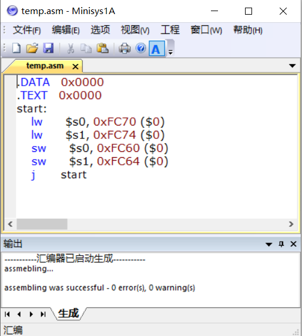
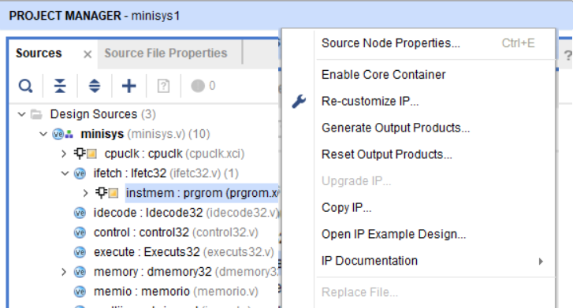
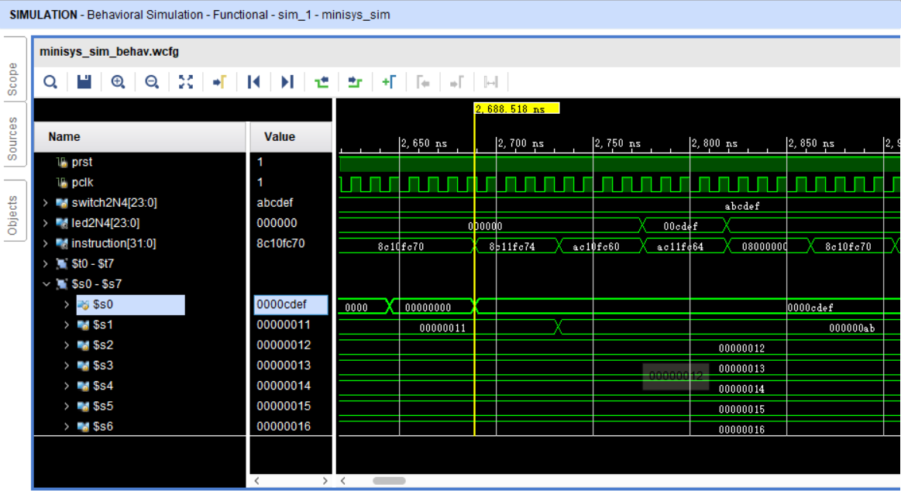

# asm_test

Minisys Assembly code testing: 

In `reborn/cpu/minisys1/minisys1.srcs/sources_1/ip/mem/` you can see
`dmem32.coe` (for RAM), and `prgmip32.coe` (for ROM). 

1. write Minisys Assembly code, say `src/t1.asm`
2. use `Minisys1Av2.2/MinisysAv2.0.exe` to parse your ASM code into `.coe` file
   (locate in `Minisys1Av2.2/output/dmem32.coe`, `Minisys1Av2.2/output/prgmip32.coe`)
   
3. use `replace.bat` or `replace.sh` to copy `Minisys1Av2.2/output/*.coe` into 
   `output/` as well as Vivado Project Folder (`reborn/cpu/minisys1/minisys1.srcs/sources_1/ip/mem/`)
   
4. go into Vidado, re-generate RAM inital data by doing the following procedure: 
   ```
   Source - Design Sources - minisys - ifetch: Ifetc32 - Reset Output Products, 
   Source - Design Sources - minisys - ifetch: Ifetc32 - Generate Output Products; 
   Source - Design Sources - minisys - memory: dmemory32 - Reset Output Products, 
   Source - Design Sources - minisys - memory: dmemory32 - Generate Output Products. 
   ```
   
4. run Vivado simulation 
   