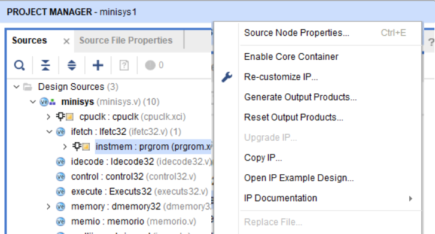
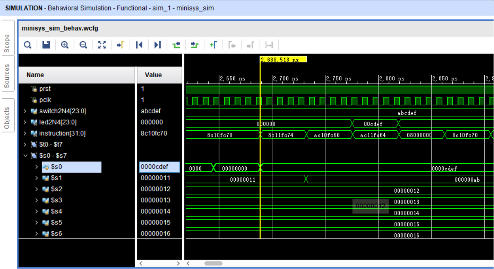

# asm_test

在minisys上测试汇编代码的流程如下: 

在 `reborn/cpu/minisys1/minisys1.srcs/sources_1/ip/mem/` 你可以看到
`dmem32.coe` (for RAM), and `prgmip32.coe` (for ROM) 两个文件, 它们决定了minisys开机后内存中的初始数据. 文件格式是可读的. 

1. 写汇编代码 Minisys Assembly code, 例如保存在 `src/t1.asm`
2. 用提供的 `Minisys1Av2.2/MinisysAv2.0.exe` 这个汇编器将你的代码汇编成 `.coe` 格式 (机器指令, 位于 `Minisys1Av2.2/output/dmem32.coe`, `Minisys1Av2.2/output/prgmip32.coe`)
   
3. 用 `replace.bat` or `replace.sh` 脚本快速地将 `Minisys1Av2.2/output/*.coe` 拷贝到 
   `output/` 和 Vivado Project Folder (`reborn/cpu/minisys1/minisys1.srcs/sources_1/ip/mem/`) 目录下. 
   
4. 到vivado里面, 通过下列步骤手动重新刷新RAM和ROM的初始值 (vivado 并不知道你更新了`dmem32.coe` (for RAM), and `prgmip32.coe` (for ROM) , 除非你显示地提醒它)
   ```
   Source - Design Sources - minisys - ifetch: Ifetc32 - Reset Output Products, 
   Source - Design Sources - minisys - ifetch: Ifetc32 - Generate Output Products; 
   Source - Design Sources - minisys - memory: dmemory32 - Reset Output Products, 
   Source - Design Sources - minisys - memory: dmemory32 - Generate Output Products. 
   ```
   
4. 进行仿真 (Vivado simulation)，观察寄存器值变化情况
   